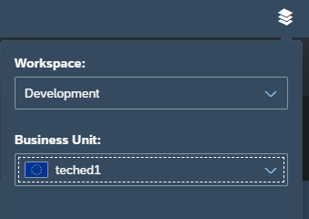

# ISP160 - SAP Customer Data Platform

## Description
This repository contains the material for the SAP TechEd 2021 session called ISP160 - SAP Customer Data Platform.  

## Overview
This session introduces attendees to integrating SAP CDP on a mock commerce site for integrating with different systems and improving the customer insights and engagement. 

## Requirements
* `git clone https://github.com/SAP-samples/teched2021-ISP160 --recurse-submodules`
* `cd shopping-cart-app && npm i`
* `npm start`
* `cd server && npm i`
* `npm start`
* [if you are facing issues, try deleting the `package.lock` file]

## Access
* In [this spreadsheet](https://sap-my.sharepoint.com/:x:/p/aliza_zeldin/EUD9VtKQflBKncwEtu2KuQsBV1c39jz9ivl3VHkGwy9yFw?e=KA3t9F) you can find a list of test SAP CDP business-units
* Write your name in the "used by" column and use only that business unit
* To access SAP CDP Console: 
  * https://universe.cdp.gigya.com
  * Login with the assigned user (password is the same as the user)
  * Pick the relevant business unit according to the workspace using the picker on the top right:
    * 

## Exercises
In this exercise we'll configure SAP CDP Business-Unit:
* Integration with a Web-Client Application
  * Reporting client side events directly to SAP CDP
* Integration with a CDC CIAM Application
  * Reporting registration and login events
* Integration with a WooCommerce Application
  * Reporting Order events
* Integration with an Emarsys Application
  * Creating a customer journey for engaging a customer via email
* Create a CDP Connector
  * Simulating activating a priority delivery for a VIP customer
 

## How to obtain support

Support for the content in this repository is available during the actual time of the online session for which this content has been designed. Otherwise, you may request support via the [Issues](../../issues) tab.

## License
Copyright (c) 2021 SAP SE or an SAP affiliate company. All rights reserved. This project is licensed under the Apache Software License, version 2.0 except as noted otherwise in the [LICENSE](LICENSES/Apache-2.0.txt) file.
